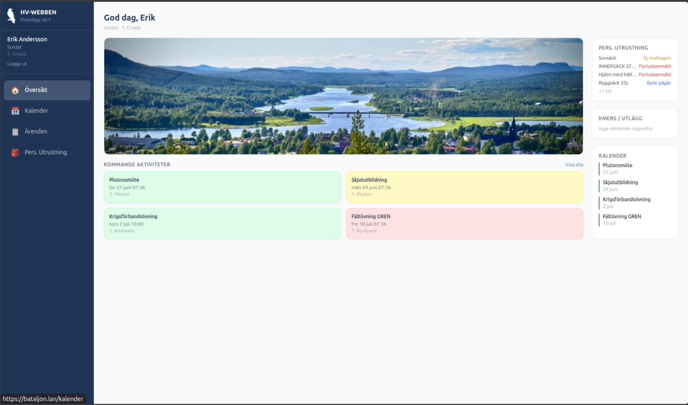

# Hv-webben

Självhostad prototyp av ett digitalt administrativt stödsystem för Hemvärnets kompani- och bataljonsförband. Syftet är att ersätta manuella processer (Excel-listor, pappersblanketter, e-post) med ett modernt webbgränssnitt anpassat för Hemvärnets organisationsstruktur och roller.

> **Status:** Aktiv prototyp — funktionell men inte produktionsklar. Saknar riktig BankID-integration, e-postnotiser och säkerhetshärdning för publikt internet.



---

## Arkitektur

```
┌─────────────────────────────────────────────────────┐
│  Webbläsare                                         │
│  React 18 + Vite + Tailwind CSS                     │
└───────────────────┬─────────────────────────────────┘
                    │ HTTP/JSON (REST)
┌───────────────────▼─────────────────────────────────┐
│  Node.js 20 + Express                               │
│  JWT-autentisering · Rollbaserad åtkomstkontroll    │
└───────────────────┬─────────────────────────────────┘
                    │
┌───────────────────▼─────────────────────────────────┐
│  PostgreSQL 15                                      │
│  org_units · users · activities · reports           │
│  equipment · equipment_cases · inventory            │
└─────────────────────────────────────────────────────┘
```

**Stack:**
- **Frontend:** React 18, Vite, Tailwind CSS, React Router
- **Backend:** Node.js 20, Express, `pg` (PostgreSQL-klient), `jsonwebtoken`, `multer`, `xlsx`
- **Databas:** PostgreSQL 15
- **Deploy:** LXC-container på Proxmox (Debian), systemd-tjänst

---

## Roller och behörigheter

| Kod | Roll | Behörighet |
|-----|------|-----------|
| `soldat` | Soldat | Egna ärenden, utrustning, kalender |
| `grpc` | Gruppchef | + Enhetssida (gruppens medlemmar) |
| `pc` | Plutonchef | + Granska km-ers/utlägg, skapa aktiviteter |
| `toc` | Troppchef | Som pc |
| `kompc` | Kompanichef | + Attestera rapporter, utrustningsärenden, personalimport |
| `kvm` | Komp-VKM | Som kompc |
| `s4` | S4 / Bat-VKM | Som kompc |
| `batc` | Bataljonschef | Som kompc |
| `s1` | S1 | Som kompc |

Inloggning sker idag via **simulerad BankID** (rollväljare). Autentisering är JWT-baserad och redo för riktig BankID-integration.

---

## Implementerade förmågor

### Kalender
- Aktiviteter (övning, utbildning, möte, övrigt) kopplade till org-enhet
- OSA-svar: Ja / Nej / Kanske, per person
- Svarssummering visas direkt på aktivitetskortet (✓ / ✗ / ?)
- Expanderbar deltagarlista grupperad per org-enhet
- gruppchef+ kan skapa aktiviteter

### Redovisningar (Km-ers / Utlägg / SÄVA)
- **Km-ersättning** — antal kilometer
- **Utlägg** — belopp + syfte, påminnelse om originalkvitto
- **SÄVA** (Särskild Visstidsanställning) — antal timmar, används för säkerhetsintervjuer, bostadsbesiktningar, förrådsbesök m.m.
- Fritext-aktivitet ("Övrigt") när ingen kalenderaktivitet finns
- Godkännandekedja: **Soldat → Plutonchef (granskar) → Kompanichef (attesterar)**
- Plutonchef kan avfärda med motivering — visas för soldaten
- Soldaten kan redigera och skicka in igen
- Attesterade rapporter sparas som historik (sökbar av KompC)
- Badge-notifikation i navigation för väntande ärenden

### Utrustningshantering
- Personlig utrustningslista per soldat med bilder
- Rapportera förlust eller begära byte (och ev. beställa transport)
- Ärendeflöde: soldat → KVM (godkänn/avslå)
- Förlustblankett (M7102-500360E) genereras för utskrift
- Kompaniinventering — KVM initierar, soldater bekräftar sina artiklar. Inventeringsdatum sparas

### Organisation
- Hierarkiskt org-träd: bataljon → kompani → pluton → Tropp → grupp
- Stöd för HvKomp-struktur: Chefsgrupp, Stab/TrossPluton, 1–4 Plutoner
- Import av personal från ODS/XLSX (PRIO-export)
  - Förhandsgranskning med möjlighet att redigera/ta bort rader
  - Automatisk mappning till org-enhet
  - Idempotent (re-import uppdaterar befintliga, skapar inte dubletter)
- Redigering av enskilda personer (namn, roll, enhet, kontakt)

### Dashboard / Översikt
- Personlig vy: nästa aktivitet, egna ärenden, utrustningsstatus
- Anpassad efter inloggad roll

---

## Databasschema (översikt)

```
org_units          — hierarkiskt träd (id, name, type, parent_id)
users              — personal (personal_number som nyckel, role, org_unit_id)
activities         — kalenderaktiviteter
activity_responses — OSS per person (ja/nej/kanske)
reports            — km-ers/utlägg/SÄVA (status: draft→submitted→reviewed→approved)
equipment_templates — materialkatalog
equipment_items    — personlig utrustning
equipment_cases    — ärenden (förlust/byte)
inventory_sessions — inventeringsomgångar
inventory_items    — per-person-svar på inventering
```

---

## Komma igång (lokal utveckling)

**Krav:** Node.js 20+, PostgreSQL 15

### 1. Klona och installera

```bash
git clone https://github.com/SGL70/hv-webben.git
cd hv-webben

cd backend && npm install
cd ../frontend && npm install
```

### 2. Konfigurera miljövariabler

```bash
cd backend
cp .env.example .env
# Redigera .env — sätt DATABASE_URL och ett slumpmässigt JWT_SECRET
```

### 3. Skapa databasen

```bash
# Skapa PostgreSQL-databas och användare
psql -U postgres <<'SQL'
CREATE USER bataljon WITH PASSWORD 'ditt-lösenord';
CREATE DATABASE bataljon OWNER bataljon;
SQL

# Kör schema, migrationer och seed-data i ett steg
cd backend
npm run db:setup
```

`db:setup` kör följande filer i ordning:

| Fil | Innehåll |
|-----|----------|
| `schema.sql` | Alla tabeller |
| `migrate_org_stab.sql` | Stöd för stab-enhetstyp |
| `migrate_catalog.sql` | Utökad materialkatalog |
| `migrate_inventory.sql` | Inventeringstabeller |
| `migrate_loss.sql` | Förlustärenden |
| `migrate_prio.sql` | PRIO-import |
| `seed.sql` | Mock-användare + exempeldata |
| `seed_catalog.sql` | 73 standardartiklar (VSH033PG) |

### 4. Starta

```bash
# Backend (port 3000)
cd backend && npm start

# Frontend (nytt terminalfönster, port 5173)
cd frontend && npm run dev
```

Öppna `http://localhost:5173` — klicka på QR-koden för att välja testanvändare.

---

## Planerade förbättringar

### Nära (prototyp → MVP)
- [ ] Riktig BankID-integration (Freja eID eller Swedbank Pay BankID-API)
- [ ] E-postnotifieringar vid statusändringar i ärenden
- [ ] Kalender: kategorisering i Avtalsövningar (KFÖ/SÖF/SÖB), Kompletteringsutbildning och Övrigt
- [ ] Kalender: SÖB-filtrering per roll (kompc/stf/fanjunkare/kvm)
- [ ] Exportera redovisningar till PDF/Excel för vidarebefordran till MR-grupp

### Funktionella tillägg
- [ ] Mobilanpassning / PWA (push-notiser)
- [ ] Närvaro­registrering vid genomförd aktivitet (grpc markerar faktisk närvaro)
- [ ] Befälsplanering / tjänstgöringslista
- [ ] Dokumenthantering (order, kallelser, instruktioner)
- [ ] Karta med övningsområden
- [ ] Skapa transportbeställningar

### Tekniska förbättringar
- [ ] Automatiserade tester (backend: Jest + supertest, frontend: Vitest)
- [ ] Säkerhetshärdning för exponering mot internet (rate limiting, CSP, audit log)
- [ ] Multi-kompani-stöd inom samma instans
- [ ] CI/CD-pipeline

---

## Skalbarhet — 25 000 användare, 40 bataljoner

Prototypen är testad i ensam-kompani-läge men datamodell och autentisering är designade för att hålla i skala. Nedan beskrivs de tre verkliga problemen och hur de löses.

### Problem 1: Multi-tenancy saknas (allvarligt)

Idag är org-trädet ett enda träd i databasen. 40 bataljoner i samma träd med delad åtkomstkontroll innebär att en bug i `getSubtreeIds` kan läcka data över bataljonsgränser.

**Lösning:** PostgreSQL Row-Level Security (RLS) med en `battalion_id`-kolumn på alla känsliga tabeller, vilket ger isolering nära datan snarare än i applikationslagret.

```sql
-- Exempel: RLS på reports
ALTER TABLE reports ENABLE ROW LEVEL SECURITY;
CREATE POLICY battalion_isolation ON reports
  USING (battalion_id = current_setting('app.battalion_id')::int);
```

### Problem 2: `pendingCount` pollas vid varje sidladdning

`/api/reports/pending-count` (3–4 DB-queries) anropas varje gång Layout.jsx renderas för samtliga inloggade användare. Vid 1 000 aktiva användare som navigerar flitigt ger det konstant onödig databasbelastning för data som sällan ändras.

**Lösning:** Server-Sent Events (SSE) eller WebSocket för push när status ändras, alternativt Redis-cache med kort TTL (30 s). SSE är enklast att lägga till utan att ändra frontend-arkitekturen.

### Problem 3: Anslutningspoolning vid horisontell skalning

`pg.Pool` defaultar till 10 connections per Node.js-process. Med flera parallella processer bakom en load balancer multipliceras antalet connections mot PostgreSQL snabbt.

**Lösning:** PgBouncer i transaction mode framför databasen absorberar connection-trycket och gör att Node.js-processerna kan skalas ut fritt.

### Planerat arkitekturlyft

```
Cloudflare / CDN
      │
  Static SPA (nginx)
      │
  Load balancer
  ├── Node.js (PM2 cluster, 4 workers)
  ├── Node.js (PM2 cluster, 4 workers)
  └── ...
        │
    PgBouncer
        │
  PostgreSQL 15 (primary + read replica)
        │
    Redis (cache + SSE pub/sub)
```

Realistisk concurrent load för Hemvärnet: ~500–1 000 användare under ett övningsveckoslut. Den nuvarande stacken klarar det med PgBouncer och PM2 utan omskrivning — multi-tenancy-isoleringen är det som *måste* på plats innan produktion.

---

## Licens

MIT — fri att använda, modifiera och dela. Prototypen är inte granskad för hantering av sekretessbelagd information.
